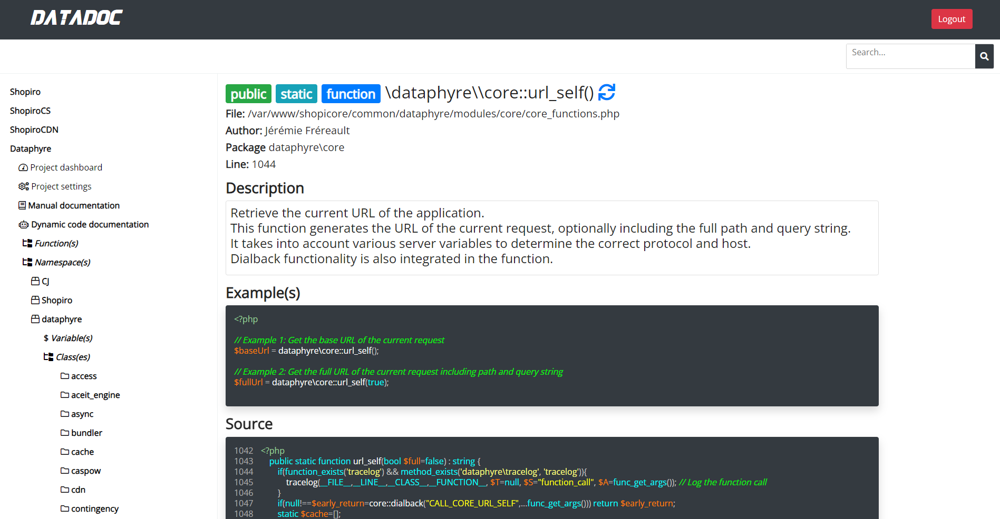

### Datadoc Module Documentation

The **Datadoc Module** within Dataphyre serves as a documentation manager and reference system, primarily for projects written in PHP. It allows structured management of project files, references, and dynamic and manual documentation (Dynadoc and Manudoc). The module relies on SQLite databases to store file and documentation data and provides tools for creating, synchronizing, and updating project documentation.

#### Core Functionalities

1. **Authentication and Session Management**
   - **`logged_in()`**: Checks if the user is logged into the Datadoc module.
   - **`login($password)`**: Authenticates the user with a password and limits login attempts.

2. **Dynamic Documentation (Dynadoc)**
   - **`dynadoc_output_record($project, $record)`**: Formats a record for display as part of the dynamic documentation, linking elements like variables, functions, namespaces, and classes.
   - **`dynadoc_output_nested_structure($project, $data, $indentation, $currentPath)`**: Recursively builds the nested structure of Dynadoc, supporting collapsible sections for easy navigation.
   - **`dynadoc_insert_data(&$arr, $path, $value)`**: Inserts data into a specified path in an array, allowing the structured insertion of documentation entries.

3. **Manual Documentation (Manudoc)**
   - **`manudoc_output_record($record)`**: Formats and displays an individual documentation record in the Manudoc interface.
   - **`manudoc_output_nested_structure($data, $indentation)`**: Recursively generates the nested structure for Manudoc, allowing hierarchical organization of manual documentation entries.

4. **URL Management**
   - **`url_self($full=false)`**: Returns the current URL, optionally including the full query string.
   - **`url_updated_querystring($url, $value, $remove)`**: Updates the query string in a URL with new values or removes specified keys.
   - **`url_self_updated_querystring($value, $remove)`**: Updates the query string for the current URL.

5. **Database Tables and Management**
   - **`document_categories_table()`**: Initializes or returns a reference to the `document_categories` SQLite table, which organizes documentation categories.
   - **`documents_table()`**: Initializes or returns the `documents` table, which holds individual documentation entries.
   - **`projects_table()`**: Initializes or returns the `projects` table, containing project metadata such as name, title, and path.
   - **`data_table()`**: Initializes or returns the `data` table, used for storing references to code elements within project files.
   - **`files_table()`**: Initializes or returns the `files` table, storing file paths, checksums, and synchronization states.

6. **Project and File Management**
   - **`create_project($name, $title, $path)`**: Creates a new project entry in the database.
   - **`add_files_to_project($dirpath, $project)`**: Adds multiple files from a specified directory to a project, recursively processing subdirectories.
   - **`add_file_to_project($filepath, $project)`**: Adds a single file to a project and triggers synchronization.
   - **`delete_file($filepath, $project)`**: Removes a file and its associated documentation records from the project.
   - **`get_stale_files($project)`**: Retrieves a list of files marked as stale, indicating files that may require re-synchronization.
   - **`sync_all_files($project)`**: Synchronizes all files in a project, updating checksums and marking files as stale if they no longer exist.

7. **File Synchronization and Content Parsing**
   - **`sync_file($file, $project)`**: Analyzes a single file and stores its elements (functions, classes, namespaces) in the `data` table for documentation purposes.
   - **`reference_functions($content, $current_project, $current_class)`**: Scans content for references to classes, functions, and namespaces within a project and creates links for these references.

8. **Utility Functions**
   - **`change_filepath($old_filepath, $new_filepath)`**: Updates file paths in the database, preserving references if a file is moved.
   - **`url_updated_querystring($url, $value, $remove)`**: Uses core's `url_updated_querystring` function to modify URLs for documentation navigation.

### Summary

The Datadoc module supports documentation creation and synchronization for PHP projects, helping manage references to variables, functions, classes, and namespaces within a project. It provides Dynadoc for dynamic, automated documentation and Manudoc for manually structured documentation, storing metadata and content in SQLite databases for efficient reference and retrieval. The Datadoc module’s hierarchical structure makes it adaptable for complex projects requiring organized, searchable documentation.